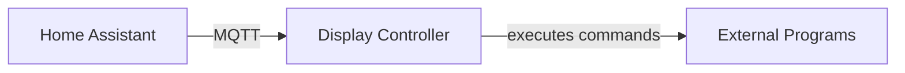
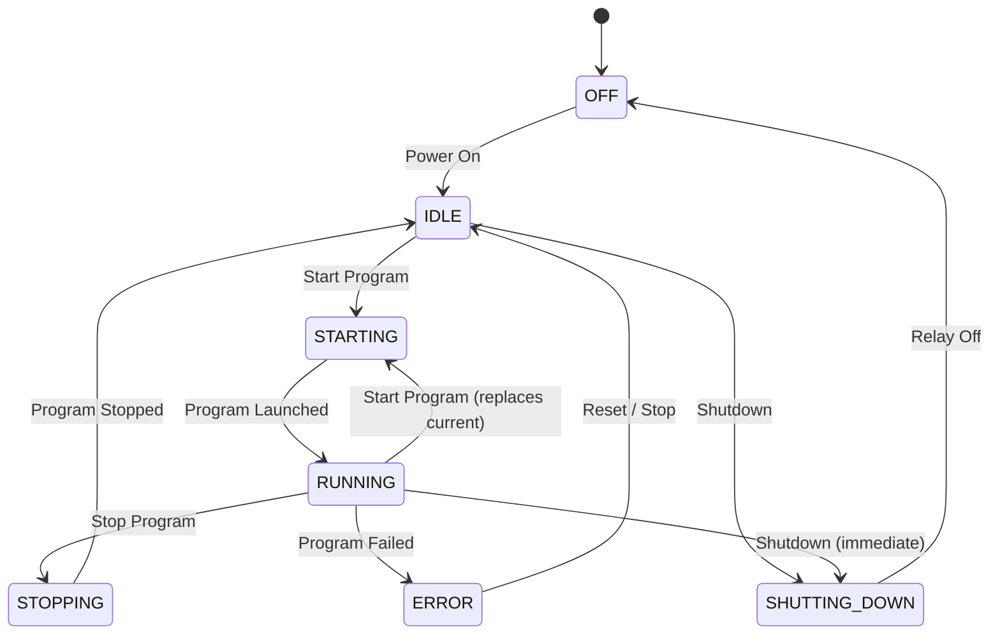

# LED Display Controller — Design Definition (v1.1)

## Purpose

A lightweight Python service on a Raspberry Pi that owns all state for what's shown on an LED matrix: discovering programs from config, starting/stopping/switching them, driving the display power relay, and reporting status to Home Assistant.

Home Assistant is a UI only — it never manages processes and is never the source of truth. The controller owns all state.

## Design Goals

Single source of truth · configuration-driven · language-independent · fail-safe · modular · minimal dependencies · one active program at a time · extensible without architectural change.

## Architecture



The controller doesn't care how a program is implemented — every application runs as a plain configured command.

## Configuration

Programs live in one YAML file. Each entry has an ID, display name, command, and optional subprograms.

```yaml
programs:
  weather:
    name: Weather
    command: python3 weather.py

  trainboard:
    name: Train Board
    command: python3 trainboard.py --station {subprogram}
    subprograms:
      berlin:
        name: Berlin Hbf
      hamburg:
        name: Hamburg Hbf
```

The controller substitutes placeholders before executing the command. Supported now:
`{subprogram}` (any program) and `{matrix_options}` (any program, expanded into
the individual `--led-*` LED matrix hardware flags from the top-level `matrix:` config
block — see `led_controller/config.py`'s `MatrixConfig`). Reserved for later:
`{language}`, `{theme}`, `{rotation}`.

If a command requests a subprogram that isn't defined in config, the request is rejected before any process starts (no state change) and an error is published.

## Process Management

Exactly one foreground program runs at a time; the controller tracks the active process handle and refuses to start a second one while it's set.

Start sequence: enter `STARTING` → request current foreground (idle animation or active program, whichever is set) to terminate → wait for graceful exit → SIGKILL on timeout → launch new program → wait for successful startup → publish `RUNNING`. There is no separate switch sequence: starting a program while one is already `RUNNING` runs the exact same sequence — the old program stops, the new one starts.

## State Machine



| State | Meaning | Accepted commands |
|---|---|---|
| `OFF` | Display PSU disabled | Power On → `STARTING`/`IDLE` |
| `IDLE` | Idle animation showing | Start Program, Shutdown |
| `STARTING` | Program launching | *(none)* |
| `RUNNING` | Program active | Start Program (replaces current), Stop, Shutdown |
| `STOPPING` | Current program stopping, no replacement queued | *(none)* |
| `SHUTTING_DOWN` | Shutdown animation + relay off | *(none)* |
| `ERROR` | Program failed; controller stays responsive | Reset, Stop, Shutdown |

Notes:
- **Power On** (`OFF`) re-enables the PSU and moves to `IDLE`, playing the idle animation; it does not auto-launch a program unless a default-startup program is configured (see Extensibility). The relay must stay de-energized from process start until this command is received — see Relay Control.
- **Stop** (`RUNNING`) goes through `STOPPING` and lands in `IDLE`. **Start Program** (`RUNNING`) goes straight back through `STARTING` with the new program/subprogram — same path as starting from `IDLE`, just with a program already in the foreground to stop first.
- **Changing a subprogram** of the already-running program is handled identically (same Start command re-invoked with a new `{subprogram}` value); it is not a separate state path.
- **Reset** (`ERROR`) force-quits whatever's in the foreground, discards the failed program/subprogram and the error, and settles into `IDLE` — it does not relaunch the program that just failed.

## Command Policy

Every command is validated against the current state; invalid commands are rejected immediately with no queue:

```
Current State: STARTING
Result: Rejected — controller busy
```

Commands received while busy are discarded, not buffered. This keeps behavior deterministic and immune to button spam.

## Home Assistant Integration

The controller publishes available programs, current state, current program/subprogram, progress, and errors. Home Assistant renders a program dropdown, subprogram dropdown, start/stop/shutdown buttons, status, and a progress indicator — and disables any control not valid for the reported state.

## MQTT Topics

**Publishes:** `display/programs`, `display/status`, `display/current`, `display/errors`

**Subscribes:** `display/control/power_on`, `display/control/start`, `display/control/stop`, `display/control/reset`, `display/control/shutdown`

## Relay Control

The Raspberry Pi always stays powered — only the LED PSU is switched. The relay must
be de-energized from the moment the controller process starts (`OFF` state) until it
receives a Power On command — never energized as a side effect of initializing the
GPIO pin. Boards wired active-low need `relay.active_low: true` in config.yaml so
`RelayController.off()` actually de-energizes the physical relay instead of the
reverse — see `led_controller/relay.py`.

```
RUNNING → Shutdown command → shutdown animation → stop active program
        → disable PSU relay → OFF
```

## Error Handling

If a program exits unexpectedly: publish `ERROR` + error details, stop the failed process, show the idle animation, and stay controllable. The controller must never crash because an application crashed.

## Extensibility

No architectural changes should be needed for: brightness control, automatic schedules, screensaver, watchdog, program health monitoring, program metadata, remote logging, OTA updates, display statistics, multiple display profiles, automatic startup program, REST API, web dashboard.

## Design Principles

- Home Assistant is never the source of truth; the controller owns all state.
- Exactly one display program is active at a time.
- All applications are external executables in any language — no hardcoded apps.
- No command queue; busy states reject new commands outright.
- Configuration over code.
- Failures are isolated to the failing application.
- Every state transition and every command is explicit and validated.
- Runs indefinitely without manual intervention.

---
**Document Version:** 1.1 · **Status:** Approved for implementation
